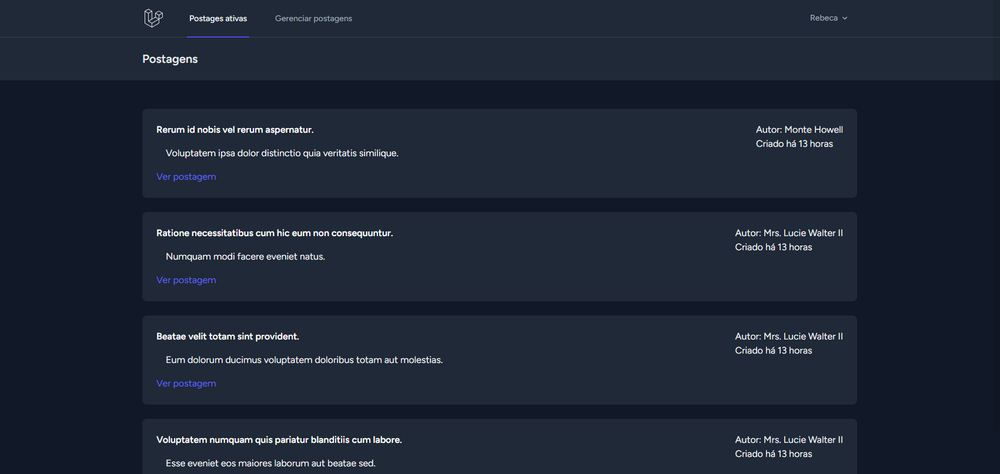
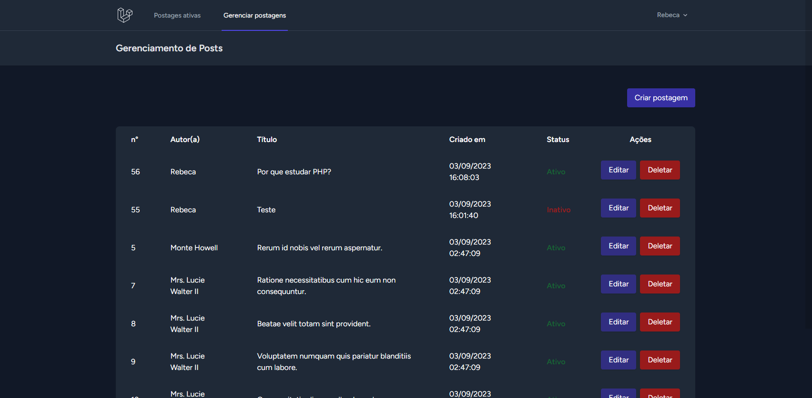
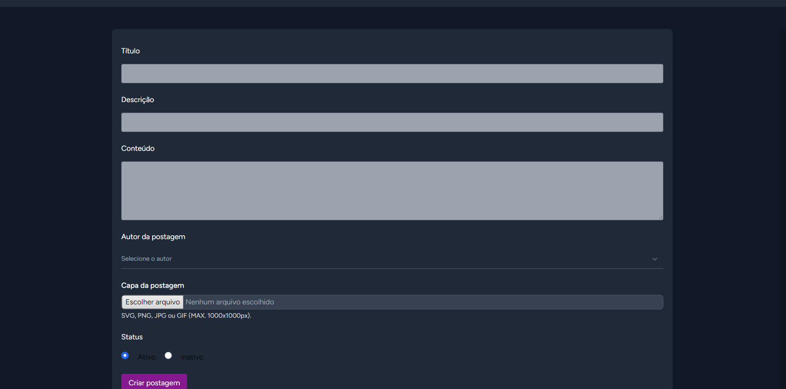
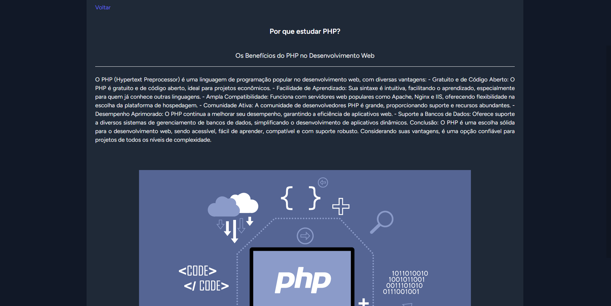

## 💻 Descrição do projeto

O projeto foi desenvolvido com o intuito de aprofundar meus conhecimentos em PHP e e no framework Laravel. 

O usuário poderá criar uma conta, realizar o login e gerencie postagens de um blog, podendo realizar ações de criação, edição, exlusão e listagem de todas as postagens criadas, contemplando todas as ações de CRUD dentro dos padrões de comunicação .

Neste projeto foi utilizado o pacote do Breeze do Laravel, que  fornece um conjunto de recursos para autenticação como registro, login, reset de senha e verificação de email, proporcionando um start acelerado para o projeto e garantindo a proteção das rotas autenticadas.  

## 🎨 Layout

  

  
    
  

  

Link do vídeo: 
https://www.vidline.com/share/V0WRHL51G2/3b4a05ca91767117d148a5ba9543f7ff

## 🛠 Tecnologias e Conhecimentos desenvolvidos

- PHP 8
- Framework Laravel
- POO
- Banco de dados MySQL
- Modelo MVC
- Controllers RESTfull
- HTML 5
- Estilização com Tailwind CSS

Feito com ❤️ por Rebeca Bertolini 👋🏽 [Entre em contato!](https://www.linkedin.com/in/rebeca-bertolini-spósito-544048200/)
